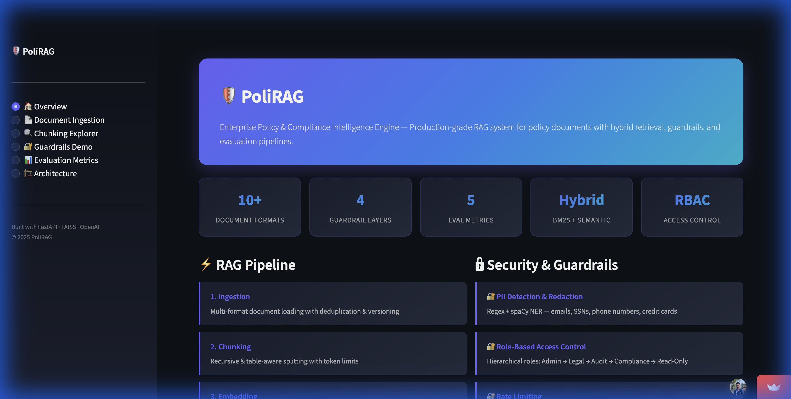
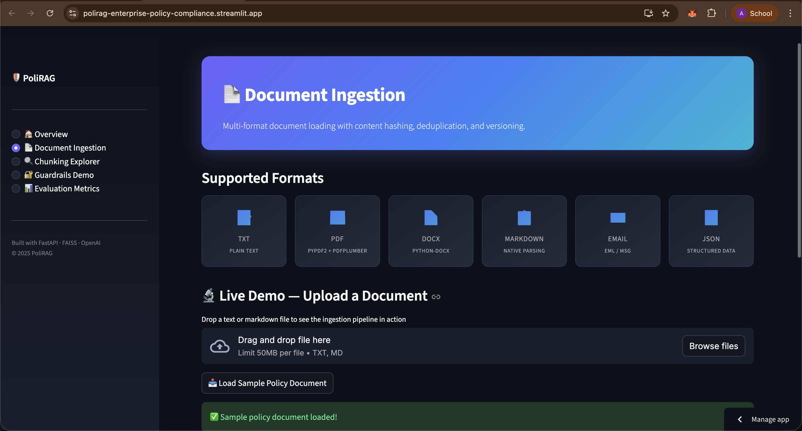
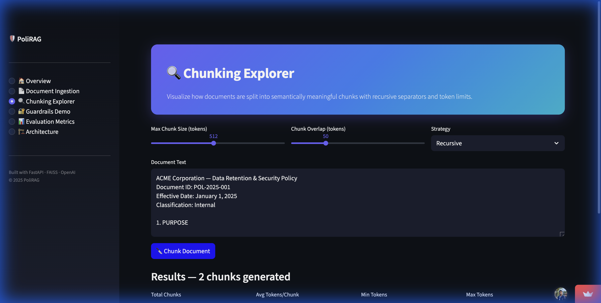
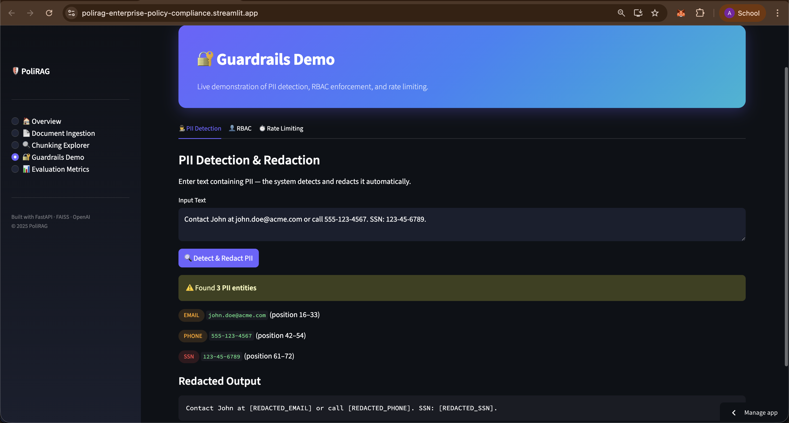
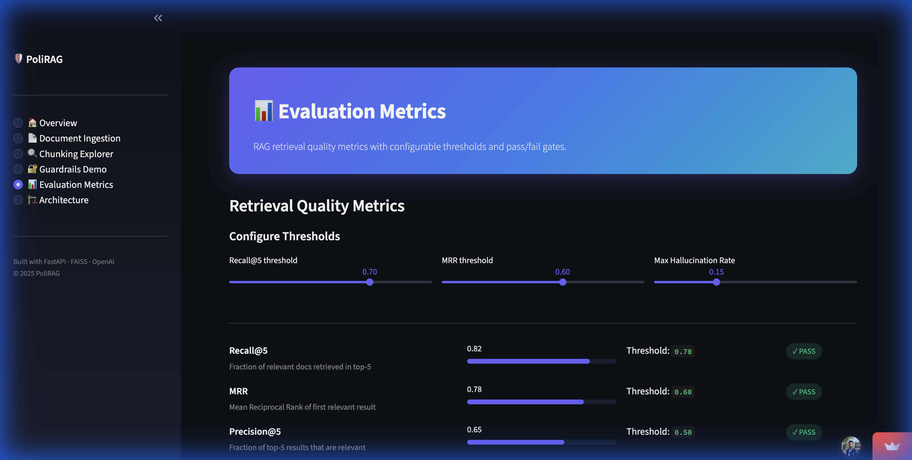
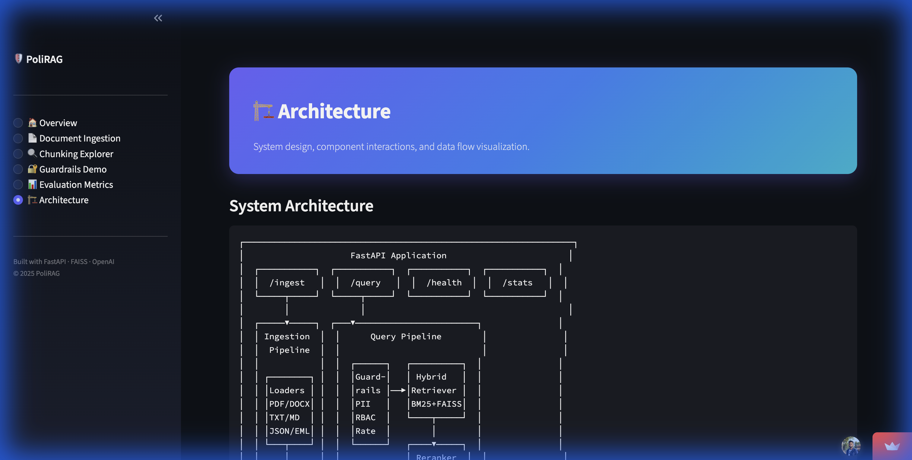

# 🛡️ PoliRAG — Enterprise Policy & Compliance Intelligence Engine

> **A production-grade RAG system for enterprise compliance, policy reasoning, and audit-safe AI.**

[](https://www.python.org/downloads/)
[](https://fastapi.tiangolo.com/)
[](LICENSE)
[](https://polirag-enterprise-policy-compliance.streamlit.app/)

<p align="center">
  <a href="https://polirag-enterprise-policy-compliance.streamlit.app/">
    
  </a>
</p>

---

## 🎯 Overview

PoliRAG is an **enterprise-grade Retrieval-Augmented Generation (RAG) system** designed for compliance, legal, and audit teams. It treats documents as first-class data assets with versioning, access control, evaluation, and full observability — built to ensure **no hallucinated answers** leave the system.

### ✨ Key Features

| Feature | Description |
|---------|-------------|
| 🎯 **No Hallucinations** | Citation-required responses with confidence thresholds and hallucination detection |
| 🔍 **Hybrid Search** | BM25 (keyword) + FAISS (semantic) with cross-encoder reranking |
| 🔒 **RBAC & Multi-Tenancy** | Hierarchical role-based access: Admin → Legal → Audit → Compliance → Read-Only |
| 🕵️ **PII Protection** | Regex + spaCy NER for emails, SSNs, phone numbers, credit cards, names |
| 📊 **Evaluation-Driven** | Automated Recall@K, MRR, Precision@K, NDCG, and hallucination rate tracking |
| 📄 **Document Versioning** | Content-hash deduplication, version tracking, and ingestion manifests |
| ⚡ **Production-Ready** | Prometheus metrics, structured logging, rate limiting, Docker support |
| 🧪 **Fully Tested** | 42-test pytest suite covering ingestion, chunking, guardrails, retrieval, and evaluation |

---

## 📸 Demo Screenshots

| **Overview Dashboard** | **Document Ingestion** |
|:---:|:---:|
|  |  |

| **Interactive Chunking** | **Guardrails Enforcement** |
|:---:|:---:|
|  |  |

| **Evaluation Metrics** | **System Architecture** |
|:---:|:---:|
|  |  |

---

## 🏗️ Architecture

```
┌─────────────────────────────────────────────────────────────────────┐
│                        FastAPI Application                         │
│   ┌───────────┐  ┌───────────┐  ┌───────────┐  ┌───────────┐     │
│   │  /ingest   │  │  /query   │  │  /health  │  │  /metrics │     │
│   └─────┬──────┘  └─────┬─────┘  └───────────┘  └───────────┘     │
│         │               │                                          │
│   ┌─────▼──────┐  ┌────▼──────────────────────────┐               │
│   │ Ingestion  │  │       Query Pipeline           │               │
│   │  Pipeline  │  │                                │               │
│   │  ┌───────┐ │  │  ┌────────┐    ┌───────────┐  │               │
│   │  │Loaders│ │  │  │Guard-  │    │  Hybrid   │  │               │
│   │  │PDF/DOC│ │  │  │rails   │───▶│ Retriever │  │               │
│   │  │TXT/MD │ │  │  │PII     │    │BM25+FAISS │  │               │
│   │  │JSON   │ │  │  │RBAC    │    └─────┬─────┘  │               │
│   │  └───┬───┘ │  │  │Rate    │          │        │               │
│   │      │     │  │  └────────┘    ┌─────▼─────┐  │               │
│   │  ┌───▼───┐ │  │               │ Reranker  │  │               │
│   │  │DocMgr │ │  │               │Cross-Enc. │  │               │
│   │  │Dedup  │ │  │               └─────┬─────┘  │               │
│   │  └───┬───┘ │  │                     │        │               │
│   │      │     │  │               ┌─────▼─────┐  │               │
│   │  ┌───▼───┐ │  │               │Generator  │  │               │
│   │  │Chunker│ │  │               │Citations  │  │               │
│   │  │Table  │ │  │               │Halluc.Det │  │               │
│   │  └───┬───┘ │  │               └───────────┘  │               │
│   │      │     │  └──────────────────────────────┘               │
│   │  ┌───▼───┐ │                                                  │
│   │  │Embed  │ │  ┌──────────────────────────────┐               │
│   │  │Cached │ │  │      Observability           │               │
│   │  └───┬───┘ │  │  Loguru + Prometheus         │               │
│   │      │     │  └──────────────────────────────┘               │
│   │  ┌───▼───┐ │                                                  │
│   │  │FAISS  │ │  ┌──────────────────────────────┐               │
│   │  │BM25   │ │  │      Evaluation              │               │
│   │  └───────┘ │  │  Recall · MRR · NDCG         │               │
│   └────────────┘  └──────────────────────────────┘               │
└─────────────────────────────────────────────────────────────────────┘
```

### Data Flow

| Stage | Input | Output | Technology |
|-------|-------|--------|------------|
| **Ingestion** | Raw files (PDF, DOCX, TXT…) | Document records + metadata | PyPDF2, python-docx |
| **Chunking** | Full document text | Semantically meaningful chunks | Recursive + table-aware splitting |
| **Embedding** | Text chunks | 1536-dim vectors | OpenAI `text-embedding-3-large` |
| **Indexing** | Vectors + text | FAISS index + BM25 index | faiss-cpu, rank-bm25 |
| **Retrieval** | User query | Ranked, filtered chunks | Hybrid search + cross-encoder reranking |
| **Generation** | Top chunks + query | Cited answer + confidence | OpenAI GPT-4 |

---

## 📁 Project Structure

```
PoliRAG/
├── src/
│   ├── app/               # FastAPI endpoints + API models
│   ├── ingestion/         # Document loaders, manager, pipeline
│   ├── chunking/          # Recursive + table-aware chunking
│   ├── embeddings/        # Async batch embedding + SQLite cache
│   ├── vectorstore/       # FAISS (semantic) + BM25 (keyword)
│   ├── retrieval/         # Hybrid retriever + cross-encoder reranker
│   ├── generation/        # LLM prompt templates + citations
│   ├── guardrails/        # PII detection, RBAC, rate limiting
│   ├── eval/              # Metrics, golden dataset, eval runner
│   ├── observability/     # Loguru logging + Prometheus metrics
│   ├── config.py          # Pydantic settings (env-driven)
│   └── models.py          # Core data models (Document, Chunk, etc.)
├── tests/                 # 42 tests across 6 modules
│   ├── conftest.py        # Shared fixtures (mocked settings)
│   ├── test_ingestion.py  # Loader, dedup, pipeline tests
│   ├── test_chunking.py   # Text + table chunking tests
│   ├── test_guardrails.py # PII, RBAC, rate limiting tests
│   ├── test_retrieval.py  # BM25 + FAISS store tests
│   └── test_eval.py       # Metrics + golden dataset tests
├── scripts/               # CLI tools
│   ├── ingest.py          # Document ingestion CLI
│   ├── build_index.py     # Index building CLI
│   ├── serve.py           # API server CLI
│   └── evaluate.py        # Evaluation runner with thresholds
├── docker/                # Container infrastructure
│   ├── Dockerfile         # Multi-stage production build
│   └── docker-compose.yml # Orchestration with volumes
├── data/                  # Data storage
│   ├── raw/               # Original uploaded documents
│   ├── staged/            # Normalized + chunked text
│   ├── eval/              # Golden Q&A dataset
│   └── manifests/         # Ingestion logs and hashes
├── .streamlit/            # Streamlit theme configuration
├── streamlit_app.py       # Interactive demo app
├── requirements.txt       # Python dependencies
└── .env.example           # Environment variables template
```

---

## 🚀 Quick Start

### Prerequisites

- Python 3.11+
- OpenAI API Key

### Installation

```bash
# Clone the repository
git clone https://github.com/ashiksharonm/PoliRAG-Enterprise-Policy-Compliance-Intelligence-Engine.git
cd PoliRAG-Enterprise-Policy-Compliance-Intelligence-Engine

# Install dependencies
pip install -r requirements.txt

# Configure environment
cp .env.example .env
# Edit .env with your OpenAI API key

# Download spaCy model for PII detection
python -m spacy download en_core_web_sm
```

### Usage

#### 1. Ingest Documents

```bash
python scripts/ingest.py --path ./documents --tenant-id company-a --role legal
```

#### 2. Build Vector Index

```bash
python scripts/build_index.py
```

#### 3. Start API Server

```bash
python scripts/serve.py
# API docs available at http://localhost:8001/docs
```

#### 4. Query the System

```bash
curl -X POST http://localhost:8001/api/query \
  -H "Content-Type: application/json" \
  -d '{
    "text": "What are the data retention policies?",
    "tenant_id": "company-a",
    "user_role": "legal"
  }'
```

#### 5. Run the Streamlit Demo

```bash
streamlit run streamlit_app.py
# Opens at http://localhost:8501
```

---

## 📚 Supported Document Formats

| Format | Extension | Parser |
|--------|-----------|--------|
| Plain Text | `.txt` | Built-in |
| PDF | `.pdf` | PyPDF2 + pdfplumber |
| Word | `.docx` | python-docx |
| Markdown | `.md` | Native parsing |
| Email | `.eml` / `.msg` | Email parser |
| JSON | `.json` | Structured data |

---

## 🔒 Security & Guardrails

### Role-Based Access Control (RBAC)

Hierarchical role system with inheritance — higher roles automatically gain access to all lower-level documents:

```
ADMIN → LEGAL → AUDIT → COMPLIANCE → READ_ONLY
```

### PII Detection & Redaction

Automatically detects and redacts sensitive information using regex patterns and spaCy NER:

| PII Type | Example | Method |
|----------|---------|--------|
| Email | `user@company.com` | Regex |
| Phone | `555-123-4567` | Regex |
| SSN | `123-45-6789` | Regex |
| Credit Card | `4111-1111-1111-1111` | Regex |
| Personal Names | `John Smith` | spaCy NER |
| IP Addresses | `192.168.1.1` | Regex |

### Rate Limiting

Token-bucket per tenant with configurable burst capacity and automatic refill.

---

## 📊 Evaluation Framework

PoliRAG includes a built-in evaluation framework for measuring retrieval and generation quality:

| Metric | Description | Default Threshold |
|--------|-------------|-------------------|
| **Recall@K** | Fraction of relevant docs retrieved in top-K | ≥ 0.70 |
| **MRR** | Mean Reciprocal Rank of first relevant result | ≥ 0.60 |
| **Precision@K** | Fraction of top-K results that are relevant | ≥ 0.50 |
| **NDCG@K** | Normalized Discounted Cumulative Gain | ≥ 0.60 |
| **Hallucination Rate** | Rate of unsupported claims | ≤ 0.15 |
| **Confidence Score** | Mean LLM confidence in answers | ≥ 0.70 |

### Running Evaluations

```bash
# Create sample golden dataset
python scripts/evaluate.py --create-sample

# Run evaluation with threshold checks
python scripts/evaluate.py --recall-threshold 0.70 --mrr-threshold 0.60
```

---

## 🧪 Testing

The project includes **42 tests** across 6 modules:

```bash
# Run full test suite
pytest tests/ -v

# Run specific modules
pytest tests/test_ingestion.py -v    # Loaders, dedup, pipeline
pytest tests/test_chunking.py -v     # Recursive + table chunking
pytest tests/test_guardrails.py -v   # PII, RBAC, rate limiting
pytest tests/test_retrieval.py -v    # BM25, FAISS stores
pytest tests/test_eval.py -v         # Metrics, golden dataset

# With coverage
pytest tests/ -v --cov=src
```

---

## 🔧 Configuration

All configuration is managed via environment variables. See `.env.example` for the full list.

```bash
# Chunking
CHUNK_SIZE=512
CHUNK_OVERLAP=77

# Retrieval
RETRIEVAL_TOP_K=20
RETRIEVAL_RERANK_TOP_K=5
RETRIEVAL_BM25_WEIGHT=0.3
RETRIEVAL_SEMANTIC_WEIGHT=0.7

# Generation
GENERATION_CONFIDENCE_THRESHOLD=0.65
GENERATION_REQUIRE_CITATION=true

# Guardrails
ENABLE_PII_REDACTION=true
ENABLE_RBAC=true
ENABLE_RATE_LIMITING=true
RATE_LIMIT_REQUESTS_PER_MINUTE=60
```

---

## 📈 Monitoring & Observability

### Structured Logging

Loguru with JSON + human-readable output, configurable via `LOG_LEVEL`.

### Prometheus Metrics

Available at `/metrics`:

| Metric | Type | Description |
|--------|------|-------------|
| `polirag_requests_total` | Counter | Total API requests by endpoint |
| `polirag_retrieval_duration_seconds` | Histogram | Retrieval latency |
| `polirag_generation_confidence` | Histogram | Answer confidence distribution |
| `polirag_eval_recall_at_k` | Gauge | Current Recall@K score |
| `polirag_eval_hallucination_rate` | Gauge | Current hallucination rate |
| `polirag_pii_detections_total` | Counter | PII entities detected |

---

## 🐳 Docker Deployment

```bash
# Build image
docker build -t polirag:latest -f docker/Dockerfile .

# Run with Docker Compose
docker-compose -f docker/docker-compose.yml up
```

The Docker setup uses a multi-stage build for minimal image size, runs as a non-root user, and includes health checks.

---

## 🛠️ Tech Stack

| Category | Technologies |
|----------|-------------|
| **Backend** | Python 3.11, FastAPI, Pydantic v2, Uvicorn |
| **AI / ML** | OpenAI GPT-4, text-embedding-3-large, Sentence Transformers, Cross-Encoder |
| **Vector Search** | FAISS (semantic), BM25 (keyword), Hybrid retrieval |
| **NLP** | spaCy (NER), rank-bm25 |
| **Storage** | SQLite (embedding cache), FAISS indexes, JSON manifests |
| **Observability** | Loguru, Prometheus, structured JSON logging |
| **Infrastructure** | Docker, Docker Compose |
| **Testing** | pytest, pytest-mock, pytest-asyncio |
| **Frontend** | Streamlit (interactive demo) |

---

## 📄 License

This project is licensed under the MIT License — see the [LICENSE](LICENSE) file for details.

---

## 🤝 Contributing

Contributions are welcome! Focus areas:
- Bug fixes and performance improvements
- Additional document format support
- Enhanced evaluation metrics
- UI/UX improvements for the Streamlit demo

---

<p align="center">
  <strong>Built for production. Designed for compliance. Tested for reliability.</strong>
  <br><br>
  <a href="https://polirag-enterprise-policy-compliance.streamlit.app/">
    
  </a>
</p>
